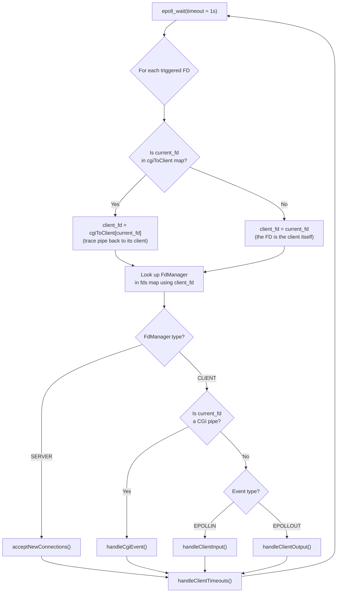

# WebServ — Server Loop Flow

This document explains the infinite event loop at the heart of the web server: `ServerSide::communication_part()`.

---

## Overview

The server uses a **single-threaded, non-blocking** architecture powered by the Linux `epoll` system call. Instead of creating one thread per client (which doesn't scale), the server asks the OS kernel: *"Tell me when any of my file descriptors have something to do."* The kernel wakes the server only when there is actual work, making it extremely efficient.

The loop monitors **three types of file descriptors**:

| FD Type | Example | Watched For |
|---|---|---|
| **Server socket** | The socket listening on port 8080 | `EPOLLIN` — a new client wants to connect |
| **Client socket** | A browser's TCP connection | `EPOLLIN` — client is sending a request, or `EPOLLOUT` — socket is ready to receive our response |
| **CGI pipe** | `to_cgi_fd` / `from_cgi_fd` | `EPOLLOUT` — pipe is ready to accept POST body, or `EPOLLIN` — CGI script has output to read |

---

## The Loop, Step by Step

### Phase 1 — Initialization (before the loop)

```
create epoll instance
add all server listening sockets to epoll (watching for EPOLLIN)
```

Each server socket (one per `listen` directive in the config) is added to `epoll`. At this point, the `fds` map only contains `SERVER`-type entries.

---

### Phase 2 — The Infinite Loop



---

### Phase 3 — What Each Handler Does

#### `acceptNewConnections()`

**Triggered when:** a server socket receives `EPOLLIN` (a new TCP connection is pending).

```
WHILE accept() succeeds:
    set new client socket to non-blocking (fcntl O_NONBLOCK)
    add client socket to epoll watching for EPOLLIN
    create a new FdManager(CLIENT) and store it in the fds map
```

> After this, the client's socket is monitored. The next time the client sends data (the HTTP request), `epoll` will fire an `EPOLLIN` event on it.

---

#### `handleClientInput()`

**Triggered when:** a client socket receives `EPOLLIN` (the browser sent data).

```
update lastActivity timestamp

TRY:
    call parseRequest(client_fd)
        |
        |-- returns false?  -->  client disconnected, remove from epoll, erase from fds
        |
        |-- request not yet complete?  -->  return, wait for more data in the next loop
        |
        |-- request IS complete:
                |
                call isCgi(server_config, script_path)
                    |
                    |-- true (CGI request):
                    |       call prepareCGI()
                    |           - creates two pipes (to_cgi, from_cgi)
                    |           - forks a child process
                    |           - child: dup2 pipes to stdin/stdout, execve the script
                    |           - parent: adds pipe FDs to epoll
                    |           - parent: maps pipe FDs → client_fd in cgiToClient
                    |
                    |-- false (static file request):
                            call buildStaticResponse()
                                - resolve the file path from the URI + server root
                                - if directory: look for index files
                                - read the file content
                                - set status 200, Content-Type, Content-Length
                            call serializeResponse("HTTP/1.1")
                            switch client socket to EPOLLOUT

CATCH HttpException:
    call buildErrorResponse()     (e.g. 404 Not Found, 400 Bad Request)
    call serializeResponse("HTTP/1.1")
    switch client socket to EPOLLOUT
```

> The `try/catch` guarantees that any error during parsing or file resolution is converted into a proper HTTP error response, never a crash.

---

#### `handleCgiEvent()`

**Triggered when:** a CGI pipe FD fires an event (the pipe is ready for I/O).

```
TRY:
    call excuteCGI(fdManager, triggered_fd, events)
        |
        |-- triggered_fd == to_cgi_fd AND EPOLLOUT:
        |       write the next chunk of the request body into the pipe
        |       if entire body is written:
        |           remove to_cgi_fd from epoll, close it
        |
        |-- triggered_fd == from_cgi_fd AND EPOLLIN:
                read available output from the CGI script
                    |-- read returns > 0:  append to response_body
                    |-- read returns 0 (EOF):
                            remove from_cgi_fd from epoll, close it
                            set cgi_state = FINISHED
                            waitpid() to reap the child process

    if cgi_state == FINISHED:
        erase pipe FDs from cgiToClient map
        call parseCgiOutput()
            - split raw output at the first blank line (\r\n\r\n)
            - extract CGI headers (Content-Type, Status, etc.)
            - extract the actual body
        call serializeResponse("HTTP/1.1")
        switch client socket to EPOLLOUT

CATCH HttpException:
    build error response (e.g. 500 Internal Server Error)
    erase pipe FDs from cgiToClient map
    switch client socket to EPOLLOUT
```

> **Why read and write are independent:** If the POST body is larger than the pipe buffer (64KB), the write side will block. Meanwhile, the CGI script might be trying to output data, causing the read pipe to fill up too. By handling both independently based on which FD triggers, we avoid a **deadlock**.

---

#### `handleClientOutput()`

**Triggered when:** a client socket receives `EPOLLOUT` (the TCP send buffer has space).

```
call send_response(client_fd)
    |
    |-- returns -1 (error):
    |       disconnect client, erase from fds
    |
    |-- returns 0 (EAGAIN, buffer full):
    |       do nothing, wait for next EPOLLOUT
    |
    |-- returns 1 (all bytes sent):
            update lastActivity timestamp
            switch client socket back to EPOLLIN (ready for next request)
            if Connection: close was requested:
                disconnect client, erase from fds
```

> `send_response()` tracks how many bytes have been sent with `bytesSent`. Each call picks up where the last one left off, so large responses are sent across multiple `epoll` iterations without blocking.

---

#### `handleClientTimeouts()`

**Runs after every batch of events** (not triggered by a specific FD).

```
for each FdManager in fds:
    if type == CLIENT AND (now - lastActivity) > 30 seconds:
        remove from epoll
        close socket
        erase from fds
```

> This prevents abandoned connections from consuming server resources indefinitely.

---

## The Complete Lifecycle of a Request

Here is the full journey of a single HTTP request through the server, from connection to response:

```
Browser connects to port 8080
        │
        ▼
┌─── epoll_wait fires EPOLLIN on server socket ───┐
│   acceptNewConnections()                         │
│   → accept(), set non-blocking, add to epoll     │
└──────────────────────────────────────────────────┘
        │
        ▼
┌─── epoll_wait fires EPOLLIN on client socket ────┐
│   handleClientInput()                             │
│   → parseRequest() reads partial data             │
│   → request not complete yet, return              │
└──────────────────────────────────────────────────┘
        │  (browser sends more data...)
        ▼
┌─── epoll_wait fires EPOLLIN on client socket ────┐
│   handleClientInput()                             │
│   → parseRequest() completes the request          │
│   → isCgi() returns false                         │
│   → buildStaticResponse() reads file from disk    │
│   → serializeResponse() builds HTTP string        │
│   → change_epoll_event(EPOLLOUT)                  │
└──────────────────────────────────────────────────┘
        │
        ▼
┌─── epoll_wait fires EPOLLOUT on client socket ───┐
│   handleClientOutput()                            │
│   → send_response() writes bytes to socket        │
│   → all bytes sent (ret == 1)                     │
│   → change_epoll_event(EPOLLIN) for Keep-Alive    │
│   → OR disconnect if Connection: close            │
└──────────────────────────────────────────────────┘
```

---

## Key Data Structures

| Structure | Purpose |
|---|---|
| `fds` (`map<int, FdManager>`) | Maps every client socket FD to its state (request, response, CGI info, timestamps) |
| `cgiToClient` (`map<int, int>`) | Maps CGI pipe FDs back to the client socket they belong to |
| `FdManager` | Holds everything about one connection: the `HttpRequest`, the `HttpResponse`, CGI pipe FDs, CGI state, and the activity timestamp |
| `STATCGI` enum | Tracks CGI progress: `WRITE_DATA`, `READ_DATA`, `FINISHED` |

---

## Error Handling Summary

| Error | Where it's thrown | What happens |
|---|---|---|
| Malformed request line | `parseRequest()` → `parseHeaders()` | `handleClientInput` catch → 400 Bad Request |
| File not found | `buildStaticResponse()` | `handleClientInput` catch → 404 Not Found |
| Directory with no index | `buildStaticResponse()` | `handleClientInput` catch → 403 Forbidden |
| CGI script crashes | `excuteCGI()` after `waitpid()` | `handleCgiEvent` catch → 500 Internal Server Error |
| Pipe I/O failure | `excuteCGI()` on read/write error | `handleCgiEvent` catch → 500 Internal Server Error |
