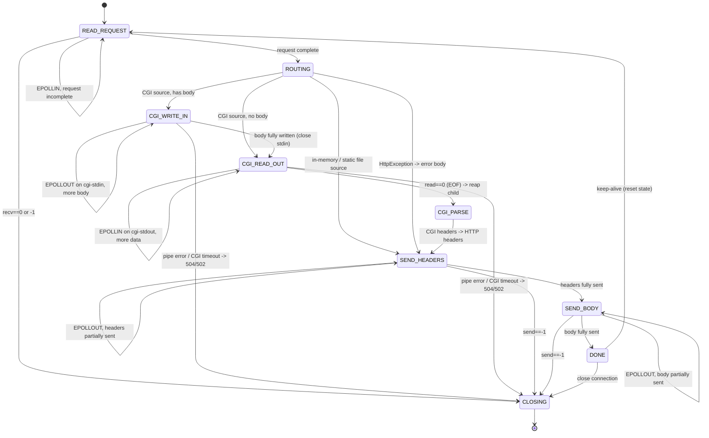

# WebServ — HTTP Response System Architecture

> A design and reasoning document for the response pipeline of your event-driven
> HTTP server. It describes **how** the pieces should fit together and **why**,
> so you can implement it yourself. It contains pseudocode where it clarifies a
> decision, but no finished implementation.

---

## 0. How to read this document

Sections 1–3 build the mental model and pin down the rules from the subject.
Sections 4–8 are the architecture itself (ownership, lifecycle, state machine,
data flow, and the non-blocking deep dives). Section 9 is the pitfalls list.
Section 10 is a concrete, low-risk migration path from your current code.

Everything is grounded in the classes you already have: `ServerSide`,
`FdManager`, `HttpRequest`, `HttpResponse`, `Server`, `LocationConf`.

---

## 1. Where you are today (and the three real problems)

Your current flow (in `ServerSide::communication_part`) is:

```
epoll_wait
 ├─ listener readable      → accept() loop, insert FdManager(CLIENT)
 ├─ client EPOLLIN         → request.parseRequest(fd); if complete → MOD to EPOLLOUT
 └─ client EPOLLOUT        → response.send_response(fd); if done → MOD to EPOLLIN
```

State lives in `map<int, FdManager> fds`, one `FdManager` per socket. Each
`FdManager` owns a `HttpRequest` and a `HttpResponse`. That skeleton is **good**
— keep it. The problem is *what happens between "request complete" and "start
sending"*. In the deleted `HttpResponseBuilder::build()` you tried to do the
entire thing in one synchronous call: route → open file → read file → fork CGI →
`write()` the body → collect output → serialize. That is exactly what breaks in
an event loop.

Three concrete problems to fix in the redesign:

| # | Problem | Where | Why it matters |
|---|---------|-------|----------------|
| **P1** | `errno` is inspected after `recv`/`send` (`EAGAIN`/`EWOULDBLOCK`) | `HttpRequest::readRequest`, `HttpResponse::send_response` | The subject: *"Checking the value of `errno` … after a read or write operation is strictly forbidden."* This alone can cost the whole grade. |
| **P2** | Response is produced in one blocking call; CGI is forked and its I/O done inline | old `HttpResponseBuilder::build` / `executeCGI` | A forked CGI's pipes are **exactly** the "I/O that can wait" the subject forces through the single poll. Doing it inline blocks the loop and stalls every other client. |
| **P3** | No way to route a *non-client* fd (a CGI pipe) back to the connection that owns it | `epoll_event.data.fd` + `fds` keyed by client fd | CGI introduces 1–2 extra fds per request that must live in the same epoll and be tied to a client. |

The redesign is essentially: **turn "build the response" from a function call
into a state machine that the event loop steps forward one readiness event at a
time.**

---

## 2. The rules the subject forces on the design

Distilled from the mandatory part — these are non-negotiable constraints, not
style choices:

1. **One** `epoll` instance drives *all* socket and pipe I/O (listeners,
   clients, CGI pipes). You already create exactly one — keep it that way.
2. **Never** `read`/`recv`/`write`/`send` on a socket or pipe without epoll
   having just told you it is ready.
3. **Never** look at `errno` to decide what to do after a read/write. This
   removes your ability to "loop until `EAGAIN`". The design must not need it.
4. epoll must watch **read and write** across the fleet — reads on some fds,
   writes on others, in the same loop.
5. **Regular disk files are exempt.** `read()`/`write()` on a normal file does
   not need epoll and will not meaningfully block. This is the single most
   clarifying rule for you: **only sockets and CGI pipes are epoll-managed.
   Static files are read directly.**
6. A request must **never hang forever** → every connection *and* every CGI
   child needs a deadline.
7. `fork` is allowed **only** for CGI. Static files, uploads, deletes, errors,
   autoindex — all done in-process.
8. Must support **GET/POST/DELETE**, uploads, redirects, autoindex, config'd
   error pages, and at least one CGI (you target Python via `cgi_pass .py`).

### The consequence of rules #2 and #3 (read this twice)

Because you cannot inspect `errno`, adopt this rule everywhere:

> **One I/O syscall per readiness event, and treat `-1` as "connection is
> finished".**

epoll is level-triggered by default (you are not setting `EPOLLET`), so if a
socket still has data or buffer space, the *next* `epoll_wait` re-reports it.
You therefore never need to loop-until-`EAGAIN`; you just do one `recv`/`send`
and return to the loop. Return-value semantics you *are* allowed to use:

- `recv` returns `> 0` → you got bytes.
- `recv` returns `0`   → peer closed cleanly → tear down the connection.
- `recv`/`send` returns `-1` → you may **not** ask why → treat as fatal for that
  connection and tear it down.

This is compliant, simple, and removes P1 entirely. It also applies to
`accept`: do **one** `accept` per listener readiness event (level-triggered
re-arms it next tick) instead of the `while(1) … break on EAGAIN` loop you have
now.

---

## 3. The core mental model

Two ideas carry the whole design.

### Idea A — The response is a state machine, not a function

A connection moves through states. Each `epoll_wait` iteration advances the
state machine of exactly the fds that became ready, does a **bounded** amount of
work, and returns. No step ever blocks waiting for I/O that could wait.

### Idea B — The response body comes from a "source", chosen once at routing time

After routing, the body is produced by one of a small set of **sources**:

| Source | Produces body from | epoll-managed? | Blocking risk |
|--------|--------------------|----------------|---------------|
| **In-memory buffer** | a `std::string` already built (errors, redirects, autoindex, upload/delete result) | no | none |
| **Static file** | a regular file on disk | **no** (rule #5) — read directly | none in practice |
| **CGI** | a forked child's stdout pipe | **yes** — read via epoll | would block → must be async |

The router's job is to pick the source and set up state. The event loop's job is
to pump whichever source into the client socket. This cleanly separates
*deciding what to send* from *the mechanics of sending it without blocking*.

---

## 4. Component responsibilities & ownership

Keep your class names. Add two focused pieces (`ResponseRouter`, `CgiProcess`)
and *enrich* `HttpResponse` with a state field.

```
                       ┌─────────────────────────────────────────────┐
                       │                 ServerSide                   │
                       │  owns: epoll_fd, map<int,FdManager> fds,      │
                       │        routing table for non-client fds       │
                       │  role: the ONE event loop. Dispatches         │
                       │        readiness → the right handler.         │
                       └───────────────┬──────────────────────────────┘
                                       │ owns N of
                                       ▼
                       ┌─────────────────────────────────────────────┐
                       │        FdManager  (== "Connection")           │
                       │  owns: HttpRequest, HttpResponse, CgiProcess? │
                       │        lastActivity, blockServer ref           │
                       │  role: all state for one client, alive across  │
                       │        many epoll iterations.                  │
                       └───┬───────────────┬───────────────┬───────────┘
                           │               │               │
              ┌────────────▼───┐  ┌─────────▼────────┐  ┌───▼─────────────┐
              │  HttpRequest   │  │  ResponseRouter   │  │  HttpResponse   │
              │ incremental    │  │ (stateless logic) │  │ state machine + │
              │ parser (done)  │  │ decides the source│  │ body source +   │
              └────────────────┘  └─────────┬─────────┘  │ send offset     │
                                            │ may create  └───┬─────────────┘
                                            ▼                 │ may own
                                   ┌──────────────────┐  ┌────▼──────────┐
                                   │   Server /       │  │  CgiProcess    │
                                   │   LocationConf   │  │ pid, pipes,    │
                                   │ (config lookup)  │  │ buffers, state │
                                   └──────────────────┘  └────────────────┘
```

### Responsibility table

| Class / module | Owns | Responsible for | Explicitly NOT responsible for |
|----------------|------|-----------------|--------------------------------|
| **`ServerSide`** | the single `epoll_fd`, `fds` map, non-client→connection routing table | the event loop; accept; dispatch readiness to a connection+role; register/modify/remove epoll interest; timeout sweep; teardown | HTTP semantics, routing decisions, byte formatting |
| **`FdManager` (Connection)** | `HttpRequest`, `HttpResponse`, optional `CgiProcess`, `lastActivity`, `const Server&` | holding *all* per-client state across iterations; being the stable object a pipe fd routes back to | doing I/O itself (the loop calls into it) |
| **`HttpRequest`** | raw buffer, method/path/headers/body, completion flags | incremental parsing (you already have this) | anything about the response |
| **`ResponseRouter`** (new, ~stateless) | nothing persistent | given `(request, Server)`: match `LocationConf`, check method/body-size/redirect, resolve physical path, decide **source kind**, and configure the `HttpResponse` accordingly (or throw `HttpException`) | doing the actual reading/sending; managing epoll |
| **`HttpResponse`** (enriched) | status/headers, body buffer, **`ResponseState`**, chosen source, `bytesSent`, file fd (if streaming) | producing bytes for the current state; serializing headers once; tracking send progress; formatting error/redirect/autoindex bodies | forking, epoll_ctl, routing |
| **`CgiProcess`** (new) | `pid`, `to_cgi[2]`, `from_cgi[2]`, input body + write offset, output buffer, cgi-state, spawn time | spawning, feeding stdin, draining stdout, detecting EOF, reaping, translating CGI headers → HTTP | epoll registration (the loop does that, using the pipe fds this object exposes) |
| **`Server` / `LocationConf`** | parsed config | answering "what root / methods / index / autoindex / return / upload / cgi_pass applies here" | request/response mechanics |

> **Design principle:** `ServerSide` knows *fds and epoll*. `ResponseRouter`
> knows *HTTP policy*. `HttpResponse`/`CgiProcess` know *how to produce bytes
> without blocking*. Config classes know *rules*. Keep those four worlds from
> leaking into each other.

### Why state lives in `FdManager` (question #7 answered)

The event loop returns to `epoll_wait` after every small step, so **any state
that must survive between readiness events must live in a long-lived object keyed
by the connection** — that is `FdManager`. This is why:

- `HttpRequest` is there → parsing spans multiple `EPOLLIN`s.
- `HttpResponse` is there → sending spans multiple `EPOLLOUT`s; its `bytesSent`
  is the resume point.
- `CgiProcess` must be there → the child's lifetime spans many iterations.

A subtle but important enabler: **`std::map` is node-based, so a `FdManager*`
(or `HttpResponse*`) stays valid even as you insert/erase *other* entries.** That
is what makes it safe to hand a pointer to the owning connection to epoll (see
§7) — the pointer won't dangle when a different client connects or leaves.

---

## 5. The response lifecycle (request parsed → fully sent)

End to end, with the actor for each step:

```
[EPOLLIN]  client socket readable
   └─ ServerSide → FdManager.request.parseRequest(fd)      (you have this)
        request complete?
          no  → stay in READ_REQUEST, return to loop
          yes → ServerSide asks ResponseRouter to route ────────┐
                                                                 │
[ROUTE]  ResponseRouter.route(request, server, response)  (pure CPU, no waitable I/O)
   ├─ match LocationConf (longest-prefix)                        │
   ├─ body-size / method / redirect / path-resolution checks     │
   ├─ throws HttpException on any failure → response becomes an   │
   │  in-memory error body (buildErrorResponse)                   │
   └─ picks a SOURCE:                                             │
        • in-memory (error / redirect / autoindex / upload / delete result)
        • static file  → open fd, stat size, set headers
        • CGI          → create CgiProcess, fork+exec, create pipes
                                                                  │
   ─────────────────────────────────────────────────────────────┘
        source == CGI ?
          no  → response.state = SEND_HEADERS; MOD client → EPOLLOUT
          yes → response.state = CGI_RUNNING;
                register CGI pipe fd(s) in epoll (see §6.3);
                (client socket interest is dropped until CGI output is ready)

[CGI_*]  (only if CGI) pump request body into stdin, drain stdout until EOF,
         reap child, parse CGI headers → HTTP headers/body buffer,
         unregister pipes, MOD client → EPOLLOUT, state = SEND_HEADERS

[EPOLLOUT] client socket writable
   └─ ServerSide → response.pump(fd)  (one send per event)
        SEND_HEADERS → send serialized status line + headers (may span events)
        SEND_BODY    → send body bytes from the source (may span events)
        done?
          no  → stay, return to loop (level-triggered re-arms)
          yes → state = DONE

[DONE]
   keep-alive?  yes → reset request+response, MOD client → EPOLLIN
                no  → teardown (epoll_ctl DEL + close + erase from fds)
```

Note the symmetry with what you already do — the difference is the **ROUTE** and
**CGI_*** phases in the middle, and that "produce the body" is no longer a single
blocking call.

### State machine (Mermaid)



> You can collapse `SEND_HEADERS`/`SEND_BODY` into one `SENDING` state if you
> serialize headers+body into a single buffer and just track `bytesSent` (this is
> closest to your current `send_response`). Keep them separate only if you want
> to stream a large file/CGI body without ever holding it all in memory.

---

## 6. Non-blocking deep dives

### 6.1 Serving static files

Rule #5 is your friend: a regular file is **not** waitable I/O, so you do **not**
give it an epoll fd and you do **not** need readiness for it.

Two valid strategies:

- **Read-into-memory (recommended for the mandatory part).** During ROUTING,
  `open`+`read` the whole file into `response_body`, set `Content-Length`, set
  the source to in-memory. Sending is then identical to an error page. Simple,
  correct, and the "blocking" read is exempt. Downside: a 1 GB file costs 1 GB of
  RAM.
- **Stream a chunk per `EPOLLOUT` (optimization).** Keep the file fd in
  `HttpResponse`. On each client `EPOLLOUT`: if the send buffer is empty,
  `read()` one block (e.g. 64 KB) from the file into the buffer, then `send` it.
  Refill when drained; when `read()` returns 0 the body is done. This keeps
  memory flat regardless of file size. The file `read()` is still exempt from
  epoll.

Either way, the **client socket** is the only epoll-managed fd, and the partial-
send logic in §6.4 handles large responses.

### 6.2 Error responses

Errors are the simplest source and should reuse the *same* sending path as
everything else. Your `buildErrorResponse` already does the right thing:
look up a configured `error_page`, else synthesize a default HTML page, set
`Content-Type`/`Content-Length`, fill `response_body`. That makes the source
"in-memory" and the state jumps straight to `SEND_HEADERS`.

Two design rules:

- **Routing throws, the loop catches once.** `ResponseRouter` throws
  `HttpException` for any policy failure (404/403/405/413…). A single
  `try/catch` around the routing call converts it into an error response. This is
  the pattern your old `build()` used — keep it; it is clean.
- **An error is a normal response.** After `buildErrorResponse`, there is nothing
  special about sending it. Never special-case error transmission.
- **Reading the configured error-page file must not become a new failure mode.**
  If the error page file is missing, fall back to the default page (you already
  do). Never throw *from inside* error handling — you can loop forever.

### 6.3 CGI execution (the hard part)

CGI is the only place that truly needs asynchronous fd juggling, because the
child's pipes are waitable I/O and rule #2 forbids blocking on them.

**Setup (during ROUTING, still no blocking I/O):**

1. Create two pipes:
   - `to_cgi[2]`   — server writes the **request body** → child's **stdin**.
   - `from_cgi[2]` — child's **stdout** → server **reads** the response.
2. Mark the **server-side** ends non-blocking (`O_NONBLOCK`) and `FD_CLOEXEC`
   (these are the only `fcntl` flags the subject allows). `FD_CLOEXEC` matters so
   the child doesn't inherit *other* clients' fds.
3. `fork()`. In the **child**:
   - `dup2(to_cgi[0], STDIN)`, `dup2(from_cgi[1], STDOUT)`.
   - close all four original pipe fds and — thanks to `CLOEXEC` — every other fd.
   - `chdir` to the script's directory (subject: *"run in the correct directory
     for relative path file access"*).
   - build the **CGI meta-variables** env (`REQUEST_METHOD`, `CONTENT_LENGTH`,
     `CONTENT_TYPE`, `PATH_INFO`, `QUERY_STRING`, `SCRIPT_NAME`,
     `SERVER_PROTOCOL`, `GATEWAY_INTERFACE=CGI/1.1`, `HTTP_*` for each request
     header, …) and `execve(interpreter, {interpreter, script, NULL}, env)`.
   - if `execve` fails, `_exit(non-zero)` — the parent will see it as 502.
4. In the **parent**: close the child's ends (`to_cgi[0]`, `from_cgi[1]`),
   store `pid`, `to_cgi[1]`, `from_cgi[0]`, spawn time in `CgiProcess`.

**Wiring into the loop:**

- Register `from_cgi[0]` with `EPOLLIN` and, *if there is a request body*,
  `to_cgi[1]` with `EPOLLOUT`, in the **same** epoll instance.
- **Stop watching the client socket** for now (either `EPOLLONESHOT`-style, or
  simply MOD it to 0/remove interest) — you have nothing to send yet, and you
  don't want spurious client events while mid-CGI.
- Both pipe fds must **route back to this connection** (see §7).

**Pumping (each state advances on one readiness event):**

- `CGI_WRITE_IN` — on `to_cgi[1]` writable: `write` one chunk of the body from
  the stored offset. When the whole body is written, **close `to_cgi[1]`** — this
  sends EOF to the child's stdin, which is how the CGI knows the body ended
  (subject: *"the CGI will expect EOF as the end of the body"*). Unregister it.
- `CGI_READ_OUT` — on `from_cgi[0]` readable: `read` one chunk into the output
  buffer. `read()==0` means **EOF → the child finished producing output**
  (subject: *"If no content_length is returned from the CGI, EOF will mark the
  end of the returned data."*).
- On EOF: `waitpid(pid, &status, WNOHANG)` to reap (and know exit status).
  Unregister `from_cgi[0]`.

**Parse (CGI output → HTTP response):**

- Split the buffer at the first blank line: everything before is the **CGI header
  block**, everything after is the body.
- Translate: a `Status: 404 Not Found` header → your status line; `Content-Type`
  passes through; if the CGI omitted `Content-Length`, the length is simply the
  size of the body you already buffered (EOF defined it), so set it yourself.
- Now the source is in-memory. **Re-register the client socket for `EPOLLOUT`**
  and set state `SEND_HEADERS`. From here it is an ordinary send.

**CGI failure modes you must design for (resilience is graded):**

- `fork`/`pipe` fails → 500, don't crash.
- `execve` fails / child exits non-zero with no valid header block → 502.
- Child hangs (infinite loop) → **504** after a deadline: `kill(pid, SIGKILL)`,
  reap, unregister pipes. This is why `CgiProcess` stores a spawn timestamp and
  is checked in the timeout sweep (§10).
- Client disconnects mid-CGI → you still must reap the child (no zombies) and
  close pipes.

CGI sub-lifecycle:

```
ROUTING(cgi) ──> spawn ──> [body?] ──yes──> CGI_WRITE_IN ──(all written, close stdin)──┐
                              │                                                        │
                              └──no───────────────────────────────────────────────────┤
                                                                                       ▼
                                                                                 CGI_READ_OUT
                                                                                       │ read==0 (EOF)
                                                                                       ▼
                                                                                  waitpid + CGI_PARSE
                                                                                       │
                                                                                       ▼
                                                                          SEND_HEADERS (client EPOLLOUT)
```

### 6.4 Large responses over multiple `EPOLLOUT` events

This is where your P1 lives. Design the send step as:

```
pump(fd):                          # called once per client EPOLLOUT
    remaining = buffer.size() - bytesSent
    n = send(fd, buffer.data() + bytesSent, remaining, 0)
    if n <= 0:                     # 0 or -1: cannot inspect errno -> finished
        return CLOSE
    bytesSent += n
    if bytesSent == buffer.size():
        return COMPLETE            # advance state (SEND_BODY or DONE)
    return CONTINUE                # partial write; level-trigger re-arms next tick
```

Key points:

- **`bytesSent` is the resume cursor** and *must* live in `HttpResponse`
  (survives across events). You already have it — keep it.
- **One `send` per event.** No inner `while` loop, no `EAGAIN` check. If the
  socket buffer is full, `send` writes fewer bytes (or the fd simply isn't
  reported writable next tick); either way you make progress without errno.
- For **streamed** bodies (static-file streaming or CGI), when the buffer drains
  and the source isn't exhausted, refill from the source, then continue. The
  socket remains the only thing gated by `EPOLLOUT`.

### 6.5 The "watch read and write simultaneously" requirement

Your current code MODs a client between `EPOLLIN` and `EPOLLOUT`. That satisfies
the spirit of the rule — the **single epoll instance** is watching reads on some
fds and writes on others at the same time (e.g. a CGI stdout read while a
different client's socket is write-pending). The requirement is about the *poll
call*, not about any one fd being watched for both directions at once. So:

- Per fd, set the interest that matches its state (`EPOLLIN` while reading a
  request, `EPOLLOUT` while sending). That is correct and idiomatic.
- Do **not** register a client for `EPOLLIN|EPOLLOUT` permanently and then ignore
  half the events — that produces busy-looping on spurious `EPOLLOUT`.

---

## 7. Routing non-client fds back to their connection (P3)

When `from_cgi[0]` becomes readable, `epoll_wait` hands you an fd that is **not**
in your `fds` map (which is keyed by client socket). You must get from that pipe
fd to the owning `FdManager` and know *which role* the fd plays. Two options:

**Option A — tagged pointer in `epoll_event.data.ptr` (recommended).**
Instead of `ev.data.fd`, store a small tag:

```cpp
struct EventSource {
    FdManager*  conn;                        // stable: map is node-based
    enum Role { CLIENT, CGI_STDIN, CGI_STDOUT } role;
    int         fd;
};
```

On any event you immediately know the connection and the role, no lookups. This
is the production pattern. It works precisely because `std::map` guarantees
`FdManager` addresses are stable across other insertions/erasures. Caveat: you
must free the `EventSource` when you `EPOLL_CTL_DEL` the fd (own them in the
connection, or in a `map<int, EventSource>` in `ServerSide`).

**Option B — side table (lowest churn from your current code).**
Keep `ev.data.fd`, and add to `ServerSide`:

```cpp
map<int,int> pipeToClient;   // cgi pipe fd -> owning client fd
```

On a readiness event, if `fds.count(fd)` → it's a client (as today); else look up
`pipeToClient[fd]` → get the client fd → `fds[clientfd]` → its `CgiProcess`. Erase
the entry when you close the pipe.

Either way, the dispatch in the loop becomes:

```
resolve (connection, role) from the ready fd
switch(role):
    CLIENT      → if EPOLLIN: read/parse ; if EPOLLOUT: response.pump()
    CGI_STDIN   → cgi.writeBodyChunk()
    CGI_STDOUT  → cgi.readOutputChunk()  (EOF → parse → arm client EPOLLOUT)
```

---

## 8. Data flow

```
        ┌────────┐  bytes   ┌───────────────┐ parsed request ┌───────────────┐
 client │ socket │ ───────▶ │  HttpRequest  │ ─────────────▶ │ ResponseRouter │
   ──▶  │ (recv) │          │ (incremental) │                │ + Server/Loc   │
        └────────┘          └───────────────┘                └──────┬────────┘
             ▲                                                       │ decides source
             │                                                       ▼
             │                                        ┌──────────────────────────┐
             │                                        │        source kind        │
             │                                        ├───────────┬───────┬───────┤
             │                                        │ in-memory │ file  │  CGI  │
             │                                        └─────┬─────┴───┬───┴───┬───┘
             │                                              │         │       │
             │                                     body str │  read() │  pipe │
             │                                              ▼         ▼       ▼
             │  send()  ┌──────────────────────────────────────────────────────────┐
             └───────── │                       HttpResponse                        │
                        │   headers + body buffer + bytesSent + ResponseState        │
                        │   (owns file fd if streaming; owns/refs CgiProcess if CGI) │
                        └──────────────────────────────────────────────────────────┘

  CGI body-in flow (only when request has a body):
     HttpRequest.body ──write()──▶ to_cgi[1] ══(kernel pipe)══▶ child stdin
  CGI body-out flow:
     child stdout ══(kernel pipe)══▶ from_cgi[0] ──read()──▶ CgiProcess.outBuf
                                     ──parse──▶ HttpResponse headers+body
```

Everything funnels into one `HttpResponse` buffer + `bytesSent` cursor, and the
loop's only job on the client fd is to drain that into `send`.

---

## 9. Pitfalls & mistakes to avoid

**Event-loop / non-blocking**

1. **Inspecting `errno` after `recv`/`send`/`accept`.** (You do this today.)
   Forbidden — redesign around "one op per event, `-1` = done" (§2).
2. **Looping `recv`/`send` until `EAGAIN`.** Same root cause; not needed with
   level-triggered epoll.
3. **Doing CGI I/O inline** (fork + `write` body + read output in one call).
   Blocks the whole server. Must be pumped through epoll.
4. **Blocking on a socket/pipe during ROUTING.** Routing must be pure CPU +
   exempt file I/O only. The moment you need waitable I/O, you must yield to the
   loop.
5. **Permanently arming `EPOLLIN|EPOLLOUT`** and ignoring spurious writes →
   100% CPU busy-loop. Arm interest to match state.

**Lifetime / memory / fds**

6. **Zombie CGI children.** Every fork must be `waitpid`-reaped — on success, on
   timeout-kill, and on client-disconnect-mid-CGI.
7. **Leaking pipe fds.** On every CGI end-path, close *both* server-side ends and
   `EPOLL_CTL_DEL` them and erase any routing-table entry. Fd leaks eventually
   kill `accept`.
8. **Dangling connection pointer.** If you ever switch `fds` to a container that
   moves elements (e.g. `vector`, or `unordered_map` rehash), the `data.ptr`
   scheme breaks. `std::map` is safe — don't change it casually.
9. **Erasing the map entry you're iterating** in the timeout sweep — use the
   `it++`-then-erase idiom (you already do this correctly).
10. **`SIGPIPE` crashes the process** when a CGI writes to a closed pipe or you
    `send` to a closed socket. Install `signal(SIGPIPE, SIG_IGN)` once at
    startup, or use handling that tolerates the write failing. (Subject: must
    never crash.)

**HTTP correctness**

11. **Forgetting `Content-Length` when the CGI omits it.** EOF defined the body
    length — you must compute and set it, or the browser hangs.
12. **Not un-chunking before feeding CGI.** A chunked request body must be
    decoded to raw bytes first; the CGI expects a plain body + EOF.
13. **Keep-alive resets.** On `DONE` + keep-alive you must reset *both*
    `HttpRequest` and `HttpResponse` (fresh parse state, `bytesSent=0`, cleared
    buffers) before going back to `EPOLLIN`. A half-reset object silently
    corrupts the next request on the same connection.
14. **Path traversal.** `realPath`/root-jail must reject `..` escapes → 403, or
    you serve arbitrary files.
15. **`client_max_body_size` checked too late.** Ideally reject oversized bodies
    as they arrive (413) rather than buffering gigabytes first.
16. **Throwing from inside error handling** (e.g. configured error page missing)
    → infinite recursion. Error paths must be total; fall back to the built-in
    default page.

**Small bugs already visible in your tree (worth fixing during the rework)**

17. `HttpRequest::parseBodyContent` does `buffer.erase(0)` — that erases the whole
    string (it's `erase(pos=0, len=npos)`), not just the consumed body. Should be
    `buffer.erase(0, contentLength)`.
18. `read_content` (error-page reader) normalizes newlines via `getline`, which
    corrupts binary error assets; prefer a binary read like your
    `readBinaryFile`.

---

## 10. A low-risk migration path from your current code

You do not need to rewrite `ServerSide`. Evolve it in these steps, each of which
leaves the server working:

1. **Kill the `errno` dependency first (P1).** Rewrite `send_response` and
   `readRequest` to "one op per event, `-1`/`0` → finished". Do one `accept` per
   listener event. This is small and makes you compliant immediately.
2. **Reintroduce routing as `ResponseRouter::route(request, server, response)`**
   — essentially your deleted `HttpResponseBuilder::build`, but with two changes:
   it (a) must not fork/stream inline, and (b) sets a *source kind* + fills
   `HttpResponse` instead of fully serializing CGI itself. Static files can start
   as read-into-memory (§6.1) so this step needs no epoll changes.
3. **Add `ResponseState` to `HttpResponse`** and split the `EPOLLOUT` handler
   into the `pump()` state machine (§6.4). Collapsed `SENDING` is fine at first.
4. **Add fd routing** (§7) — pick Option B (side table) for minimal churn or
   Option A (tagged ptr) if you want the clean version.
5. **Add `CgiProcess` and the CGI states** (§6.3) last, since it depends on 3 & 4.
   Wire its pipe fds into the same epoll, route them back, and feed the result
   into the same `pump()` you already built.
6. **Extend the timeout sweep** to also kill+reap CGI children past their
   deadline (produce 504). You already have the client-timeout loop — add a
   parallel check on any live `CgiProcess`.

After step 6 you have a fully non-blocking, epoll-driven response system that
serves static files, uploads, deletes, redirects, autoindex, config'd errors,
and CGI — with a single poll, no `errno` inspection, and no request able to hang
forever.

---

## 11. One-paragraph summary to hold in your head

*The event loop owns fds; the router owns HTTP policy; the response and CGI
objects own "produce bytes without blocking"; the config owns rules. A completed
request is routed once into a body **source** (in-memory, static file, or CGI).
Only sockets and CGI pipes live in the single epoll — disk files are read
directly. The connection walks a state machine, doing exactly one non-blocking
I/O operation per readiness event and resuming from a stored cursor, so large
responses, slow clients, and long-running CGI all interleave without ever
blocking the loop or touching `errno`.*
