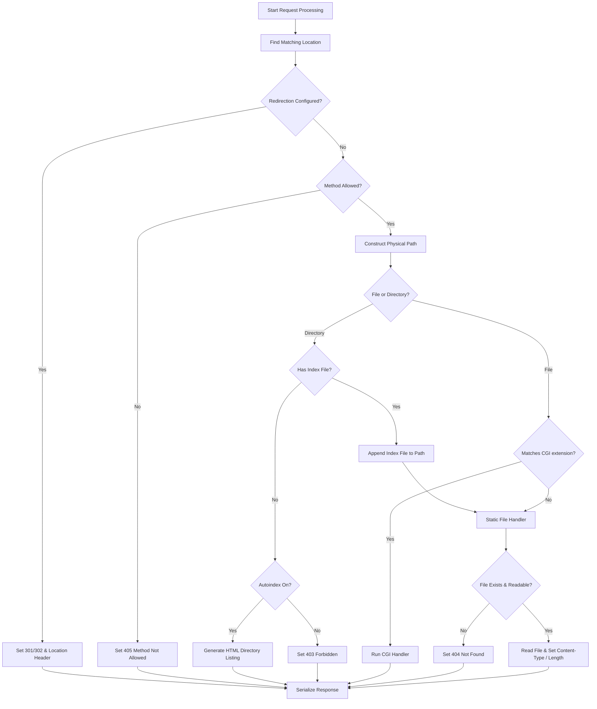

# HTTP Response Logic Implementation Guide

This guide outlines a simple, modular, and robust response-handling architecture for your web server. It maps directly onto your existing class structures: [HttpRequest](file:///home/oobbad/Desktop/webServ/src/classes/http/HttpRequest.hpp), [HttpResponse](file:///home/oobbad/Desktop/webServ/src/classes/http/HttpResponse.hpp), [Server](file:///home/oobbad/Desktop/webServ/src/classes/server/Server.hpp), and [LocationConf](file:///home/oobbad/Desktop/webServ/src/classes/location/LocationConf.hpp).

---

## 1. Architectural Clean-Up: Response Serialization

Currently, `HttpResponse::create_response` appends raw HTTP status lines and headers directly into `response_body`, which is then sent over the socket. This mixes response construction (business logic) with serialization (formatting).

### The Fix:
1. Make `response_body` store **only the payload body** (HTML, file contents, etc.).
2. Add a `std::string serialized_response` member variable to track what actually goes over the wire.
3. Implement a `serialize()` method to construct the HTTP wire format block.

### Code Changes:

In [HttpResponse.hpp](file:///home/oobbad/Desktop/webServ/src/classes/http/HttpResponse.hpp):
```cpp
class HttpResponse
{
private:
    int status_code;
    string message;
    map<string, string> response_headers;
    string response_body;      // Holds ONLY the resource body (e.g. HTML)
    string serialized_response; // Holds the fully formatted HTTP response
    size_t bytesSent;

public:
    // ... existing methods ...
    void serialize(); // Formats headers and body into serialized_response
    // ...
};
```

In [HttpResponse.cpp](file:///home/oobbad/Desktop/webServ/src/classes/http/HttpResponse.cpp):
```cpp
void HttpResponse::serialize()
{
    std::stringstream ss;
    
    // 1. Status Line
    ss << "HTTP/1.1 " << status_code << " " << (message.empty() ? getDefaultStatusMessage(status_code) : message) << "\r\n";
    
    // 2. Headers
    for (std::map<std::string, std::string>::const_iterator it = response_headers.begin(); it != response_headers.end(); ++it)
    {
        ss << it->first << ": " << it->second << "\r\n";
    }
    ss << "\r\n"; // End of headers
    
    // 3. Body
    ss << response_body;
    
    serialized_response = ss.str();
    bytesSent = 0; // Reset bytes sent counter
}
```

Update `send_response` to send `serialized_response` instead of `response_body`:
```cpp
int HttpResponse::send_response(int fd)
{
    while (bytesSent < serialized_response.size())
    {
        ssize_t n = send(fd, (serialized_response.data() + bytesSent), (serialized_response.size() - bytesSent), 0);
        if (n == -1)
        {
            if (errno == EAGAIN || errno == EWOULDBLOCK)
                return 0;
            return -1;
        }
        bytesSent += n;
    }
    return 1;
}
```

---

## 2. Catching & Mapping Exceptions to Status Codes

When request parsing fails, the parser should throw a custom exception containing the HTTP status code (e.g., `400 Bad Request` or `413 Payload Too Large`).

### The Fix:
Define a custom `HttpException` class.

In [HttpErrors.hpp](file:///home/oobbad/Desktop/webServ/src/classes/http/HttpErrors.hpp):
```cpp
#include <exception>
#include <string>

class HttpException : public std::exception
{
private:
    int _statusCode;
    std::string _message;

public:
    HttpException(int statusCode, const std::string& message) 
        : _statusCode(statusCode), _message(message) {}
    
    virtual const char* what() const throw() { return _message.c_str(); }
    int getStatusCode() const { return _statusCode; }
};
```

When parsing, throw this exception:
```cpp
if (bodyContent.size() > limit)
    throw HttpException(413, "Payload Too Large");
```

In your main loop inside [ServerSide.cpp](file:///home/oobbad/Desktop/webServ/src/classes/openConnection/ServerSide.cpp), catch it specifically to generate a valid HTTP error response:
```cpp
try 
{
    if (it->second.request.parseRequest(it->first) == false) { /*...*/ }
}
catch (const HttpException& e)
{
    // Generate error response using custom code
    it->second.response = HttpResponse::buildErrorResponse(e.getStatusCode(), it->second.blockServer);
    it->second.response.serialize();
    change_epoll_event(epoll_fd, it->first, EPOLLOUT);
}
catch (const std::exception& e)
{
    // General fallback to 500 Internal Server Error
    it->second.response = HttpResponse::buildErrorResponse(500, it->second.blockServer);
    it->second.response.serialize();
    change_epoll_event(epoll_fd, it->first, EPOLLOUT);
}
```

---

## 3. The Core Response Generation Logic

The response logic should follow a clear pipeline. Implement this inside `HttpResponse::create_response(FdManager &manager)`:



### Detailed Pipeline Steps:

### Step A: Find Matching Location (Longest Prefix Match)
Compare the request path with the configured location paths of the server block. Find the location that has the longest matching prefix.

```cpp
const LocationConf* findLocation(const string& requestPath, const Server& server)
{
    const LocationConf* bestMatch = NULL;
    size_t maxLen = 0;
    const vector<LocationConf>& locations = const_cast<Server&>(server).getLocations();

    for (size_t i = 0; i < locations.size(); ++i)
    {
        const string& locPath = locations[i].getPath();
        // Check if requestPath starts with locPath
        if (requestPath.find(locPath) == 0)
        {
            if (locPath.length() > maxLen)
            {
                maxLen = locPath.length();
                bestMatch = &locations[i];
            }
        }
    }
    return bestMatch;
}
```

### Step B: Handle Redirection (HTTP 301 / 302)
If the location block defines a return directive:
```cpp
if (location && location->hasReturn())
{
    pair<int, string> redir = location->getReturn();
    manager.response.setStatusCode(redir.first);
    manager.response.setResponseHeader("Location", redir.second);
    manager.response.setResponseBody("Redirecting...");
    manager.response.serialize();
    return;
}
```

### Step C: Method Verification (HTTP 405)
Verify that the incoming HTTP method is allowed for the matched location.
```cpp
if (location && !location->getAllowMethods().empty())
{
    const set<string>& allowed = location->getAllowMethods();
    if (allowed.find(manager.request.getMethod()) == allowed.end())
    {
        manager.response = HttpResponse::buildErrorResponse(405, manager.blockServer);
        // Set the Allow header listing permissible methods
        string allowHeader;
        for (set<string>::const_iterator it = allowed.begin(); it != allowed.end(); ++it) {
            if (it != allowed.begin()) allowHeader += ", ";
            allowHeader += *it;
        }
        manager.response.setResponseHeader("Allow", allowHeader);
        manager.response.serialize();
        return;
    }
}
```

### Step D: Construct the Physical Path
Combine the appropriate root directory with the request path.
```cpp
string root = (location && location->rootIsSet()) ? location->getRoot() : manager.blockServer.getRoot();
string physicalPath;

if (!realPath(root, manager.request.getPath(), physicalPath))
{
    // Escaping the root directory structure
    manager.response = HttpResponse::buildErrorResponse(403, manager.blockServer);
    manager.response.serialize();
    return;
}
```

### Step E: File vs. Directory Resolution
Check if the path targets a directory or file using `<sys/stat.h>`.
```cpp
struct stat pathStat;
if (stat(physicalPath.c_str(), &pathStat) != 0)
{
    manager.response = HttpResponse::buildErrorResponse(404, manager.blockServer);
    manager.response.serialize();
    return;
}
```

#### If it is a Directory:
1. **Index Search**: Check configured indexes (either in the location block or server block).
   ```cpp
   const vector<string>& indexes = (location && location->indexIsSet()) ? location->getIndex() : manager.blockServer.getIndex();
   bool indexFound = false;
   for (size_t i = 0; i < indexes.size(); ++i)
   {
       string testIndex = physicalPath + "/" + indexes[i];
       struct stat indexStat;
       if (stat(testIndex.c_str(), &indexStat) == 0 && S_ISREG(indexStat.st_mode))
       {
           physicalPath = testIndex;
           indexFound = true;
           break;
       }
   }
   ```
2. **Autoindex**: If no index file is found, check if autoindex is enabled.
   - **If Yes**: Generate an HTML directory listing (use `opendir()` and `readdir()` from `<dirent.h>`).
   - **If No**: Return `403 Forbidden`.

#### If it is a File:
Check if it matches CGI requirements:
- Compare file extension against extensions configured in `location->getCgiPass()`.
- **If CGI**: Execute the script via a CGI handler.
- **If Not CGI**: Process static request depending on the method.

---

## 4. Handler for HTTP Methods (Static Content)

### GET / HEAD
Read file contents securely in binary mode.
```cpp
bool readBinaryFile(const string& filepath, string& content)
{
    ifstream file(filepath.c_str(), ios::in | ios::binary | ios::ate);
    if (!file.is_open())
        return false;
    
    streamsize size = file.tellg();
    file.seekg(0, ios::beg);
    
    content.resize(size);
    if (file.read(&content[0], size))
        return true;
    return false;
}
```
Set correct content headers and serialize:
```cpp
string body;
if (readBinaryFile(physicalPath, body))
{
    manager.response.setStatusCode(200);
    manager.response.setResponseHeader("Content-Type", getMimeType(physicalPath, "application/octet-stream"));
    manager.response.setResponseHeader("Content-Length", intToString(body.size()));
    manager.response.setResponseBody(body);
}
else
{
    manager.response = HttpResponse::buildErrorResponse(500, manager.blockServer);
}
manager.response.serialize();
```

### POST (File Uploads)
If uploads are enabled (`location && location->uploadEnabledStatus()`):
- Retrieve directory path from `location->getUploadPath()`.
- Create a file name (either parsed from `Multipart/form-data` or using a timestamp/UUID if raw body upload).
- Write `manager.request.getBodyContent()` directly to the target file.
- Return `201 Created`.

### DELETE
Delete the file from the system:
```cpp
if (std::remove(physicalPath.c_str()) == 0)
{
    manager.response.setStatusCode(204); // No Content
    manager.response.setResponseBody("");
}
else
{
    manager.response = HttpResponse::buildErrorResponse(403, manager.blockServer); // Or 404
}
manager.response.serialize();
```
